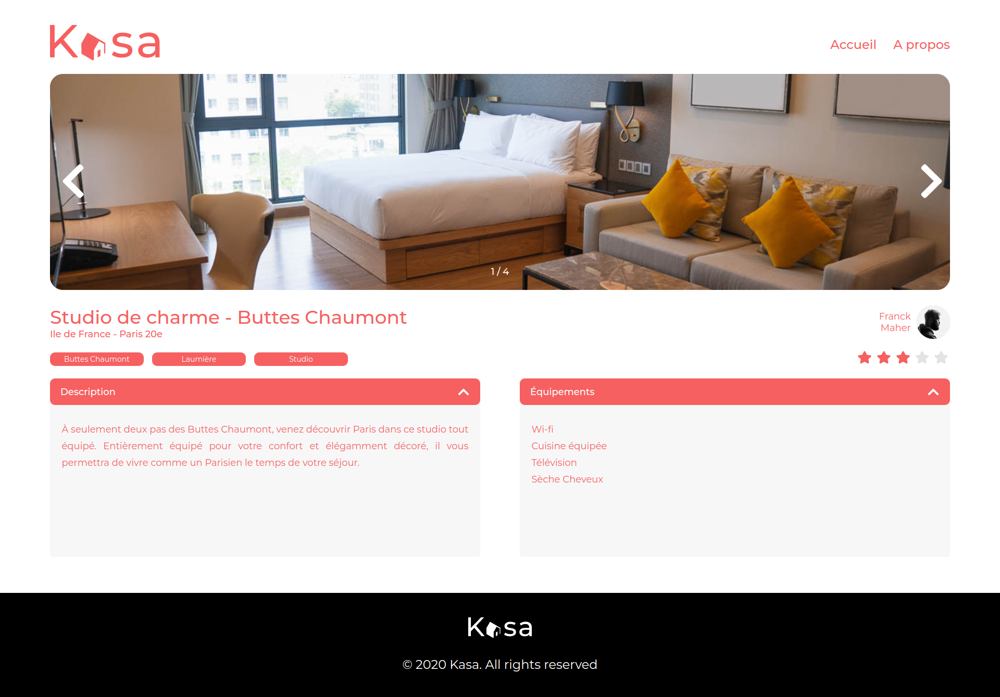

# Kasa 🏠 : Site Web de location immobilière avec React

> 🖥️ **Plateforme web de location d’appartements entre particuliers avec React !**

## 🎯 Objectif

_Refonte complète d'un site de location d'appartements entre particulier en JavaScript avec React._

## ⚛️ Technologies

&nbsp;&nbsp;&nbsp;&nbsp;

## 🧞 Commandes

Ce projet a été démarré avec [Create React App](https://github.com/facebook/create-react-app).

Toutes les commandes sont exécutées depuis la racine du projet, à partir d'un terminal :

| Command      | Action                                                                                      |
| :----------- | :------------------------------------------------------------------------------------------ |
| `yarn start` | Exécute l'application en mode développement. Ouvrez `http://localhost:3000` pour l'afficher |
